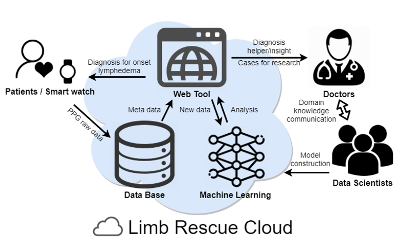

# Project Limb Rescue
Cancer patients are at risk of lymphedema, a devastating chronic complication. Our overall aim is to develop a product helping patients to monitor the risk of lymphedema. The product marries wearable devices equipped with photoplethysmography (PPG) sensors and our custom software to detect changes in limb characteristics that are concerning for new-onset, or worsening lymphedema. 
Limb Rescue Cloud, constitute of Data Base, Web Tool, and Machine Learning modules, establish connections between software, doctors, and data scientists.

## Project Limb Rescue Machine Learning Module (LimbRescueML)
LimbRescueML implements four classification algorithms, Support Vector Machine(SVM), Multilayer Perceptron(MLP), Random Forest(RF), and Naive Bayes(NB) to predict lymphedema. Users can compare four classification algorithms, train and evaluate models, and predict based on saved models.

LimbRescueML provides dataset generation([Generating Dataset](https://github.com/Rescue-Heroes/LimbRescueML#getting-started)), model training([Training](https://github.com/Rescue-Heroes/LimbRescueML#training)), model evaluation(FIXME), wave prediction(FIXME), and package installation(FIXME) pipelines.

## Installation
FIXME
## Getting Started
### Generating Dataset 
- Step 1: prepare raw data sets and coresponding annotation file. See [Raw Data Preparation](https://github.com/Rescue-Heroes/LimbRescueML/blob/main/docs/generating_dataset.md#raw-data-preparation) for more information.
- Step 2: generate preprocessed dataset for model training and wave prediction. See [Data Preprocessing](https://github.com/Rescue-Heroes/LimbRescueML/blob/main/docs/generating_dataset.md#data-preprocessing) for more infromation.

### Training
Trainig pipeline provides two functionalities:
- Training model with specific hyperparameters set. See [Training Model](https://github.com/Rescue-Heroes/LimbRescueML/blob/main/docs/training.md#training-model-with-hyperparameters-specified) for more information.
- Tuning hyperparameters to find the best model settings. See [Tuning hyperparameters](https://github.com/Rescue-Heroes/LimbRescueML/blob/main/docs/training.md#tuning-hyperparameters-for-best-model-settings) for more information.

### Evaluation
FIXME
### Prediction
FIXME
## Model Zoo and Baselines
_NOTE: The following performance table and confusion matrices are generated based on raw data provided by July 19th, 2021._

We performed five tuning hyperparameters runs and picked the hyperparameters set with the highest validation accuracy as default (default yaml configs) for each algorithm. Then we trained each algorithm with these default hyperparameters set five times and averaged the accuracy and confusion matrix as follows.

### Performance table
| Accuracy | Train | Test |
|:---|---:|---:|
| SVM | 0.82 | 0.67 |
| MLP | 0.92 | 0.58 |
| RF | 1.00 | 0.67 |
| NB | 0.62 | 0.58 |

### Confusion matrix for test set
| SVM | Pred. normal | Pred. left | Pred. right |
| :--- | ---: | ---: | ---: | 
| **True normal** | 20.0 (1.00) | 0.0 (0.00) | 0.0 (0.00) |
| **True left** | 10.0 (0.50) | 10.0 (0.50) | 0.0 (0.00) |
| **True right** | 10.0 (0.50) | 0.0 (0.00) | 10.0 (0.50) |

| MLP | Pred. normal | Pred. left | Pred. right |
| :--- | ---: | ---: | ---: | 
| **True normal** | 11.6 (0.58) | 0.0 (0.00) | 8.4 (0.42) |
| **True left** | 5.0 (0.25) | 14.0 (0.70) | 1.0 (0.05) |
| **True right** | 10.0 (0.50) | 0.8 (0.04) | 9.2 (0.46) |

| RF | Pred. normal | Pred. left | Pred. right |
| :--- | ---: | ---: | ---: |
| **True normal** | 18.8 (0.94) | 0.0 (0.00) | 0.0 (0.00) |
| **True left** | 8.4 (0.42) | 11.6 (0.58) | 0.0 (0.00) |
| **True right** | 10.4 (0.52) | 0.0 (0.00) | 9.6 (0.48) |

| NB | Pred. normal | Pred. left | Pred. right |
| :--- | ---: | ---: | ---: |
| **True normal** | 20.0 (1.00) | 0.0 (0.00) | 0.0 (0.00) |
| **True left** | 15.0 (0.75) | 5.0 (0.25) | 0.0 (0.00) |
| **True right** | 10.0 (0.50) | 0.0 (0.00) | 10.0 (0.50) |

## People
Sponsors: Carlo Contreras, Lynne Brophy

Technical Team: 
- [Tai-Yu Pan](https://github.com/tydpan) implemented dataset generation pipeline, model trainning and evaluation pipeline
- [Mengdi Fan](https://github.com/mengdifan) implemented model training and evaluation pipeline, generated documetation
- [Rithvich Ramesh](https://github.com/rithvichramesh) tested the gaussian naive bayes algorithm
- [Browy Li](https://github.com/BrowyLi) tested the random forest algorithm

